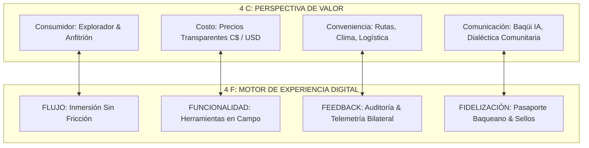
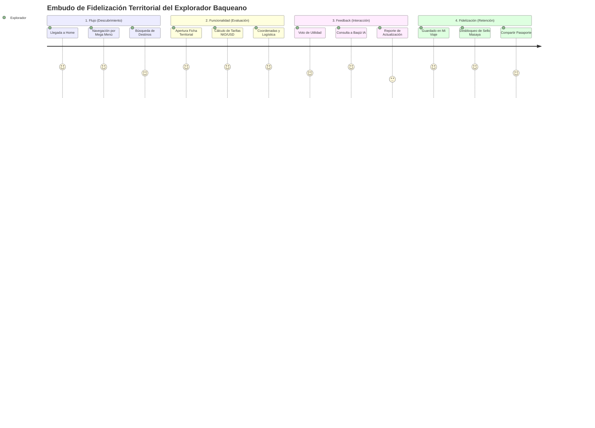

# 🧭 MANUAL ESTRATÉGICO: LAS 4 F DEL MARKETING DIGITAL EN BAQUEANO

```
============================================================================
🧭 BAQUEANO ECOSYSTEM — MODELO ESTRATÉGICO DE LAS 4 F DEL MARKETING DIGITAL
============================================================================
🎯 1. POR QUÉ (WHY / PROPÓSITO):
- Adaptar el modelo clásico de Paul Fleming (Flujo, Funcionalidad, Feedback, Fidelización)
  a la realidad socio-tecnológica del turismo comunitario y la soberanía territorial
  en Nicaragua.
- Superar el marketing tradicional publicitario y sustituirlo por un ecosistema de
  inmersión digital, utilidad operativa en campo, gobernanza de datos descentralizada
  y gamificación con impacto económico directo en familias y cooperativas locales.

⚙️ 2. CÓMO (HOW / ARQUITECTURA & IMPLEMENTACIÓN):
- Flujo: Navegación ergonómica continua, mega menú 21st MCP, cero callejones sin salida.
- Funcionalidad: Datos auditados en 8 puntos, coordenadas exactas, calculadora multimoneda.
- Feedback: Microinteracciones de utilidad territorial, reporte de datos y telemetría de IA.
- Fidelización: Pasaporte Baqueano con sellos coleccionables y progreso en 17 departamentos.

📦 3. QUÉ (WHAT / ENTREGABLES & SISTEMAS):
- Framework conceptual, embudos de conversión, métricas de retención, manual de moderación
  y roadmap de evolución tecnológica para website/ y lib/.
============================================================================
```

> **Eslogan Oficial:** *“DESCUBRE LO QUE NO SALE EN EL MAPA”*  
> **Plataforma Web:** [https://app-baqueano.web.app](https://app-baqueano.web.app)  
> **Arquitectura:** Firebase Hosting + Supabase DB + Cloud Functions + Antigravity Agent Skills  

---

## 🏛️ 1. INTRODUCCIÓN Y ALINEACIÓN ESTRATÉGICA

El modelo de las **4 F del Marketing Digital** complementa de forma directa el **Modelo de las 4 C de BAQUEANO** (*Consumidor, Costo, Conveniencia, Comunicación*):



En BAQUEANO, cada "F" responde a una necesidad humana real del viajero y del productor campesino, erradicando intermediarios y comisiones abusivas.

---

## 🌊 2. LAS 4 F EXPLICADAS EN BAQUEANO

### 2.1 FLUJO (FLOW)

El **Flujo** describe el estado psicológico y operativo en el que el usuario navega por la plataforma de manera fluida, ininterrumpida y placentera.

#### Pilares de Flujo en BAQUEANO:
1. **Navegación Táctica sin Fricciones:**
   - La barra de navegación horizontal global (`website/js/navigation.js` y `css/navigation-mega.css`) diseñada con patrones 21st MCP provee acceso instantáneo en desktop y mobile drawer a los cuatro pilares del país: *Mi País*, *Ecosistema*, *Baqueano* y *Plataforma*.
2. **Arquitectura Cero Dead-Ends (Sin Callejones sin Salida):**
   - Toda página cuenta con enlaces bidireccionales de retorno o continuidad.
   - De la búsqueda a la ficha territorial (`destino.html`), de la ficha a la planificación con IA (`baqueano-ia.html`), de la IA al mapa táctico (`mapa.html`) y del mapa a la reserva directa con cooperativas.
3. **Velocidad y Rendimiento Visual (60fps):**
   - Transiciones visuales con curvas cúbicas suaves, renderizado modular y sin `.withOpacity()` para garantizar máximo rendimiento en dispositivos móviles.

---

### ⚙️ 2.2 FUNCIONALIDAD (FUNCTIONALITY)

La **Funcionalidad** representa la utilidad práctica y el rigor técnico de la plataforma. Si el diseño atrae, la funcionalidad retiene.

#### Pilares de Funcionalidad en BAQUEANO:
1. **Protocolo de Verificación Territorial en 8 Puntos:**
   - Toda ficha de destino cuenta con coordenadas georreferenciadas comprobadas en campo, clima promedio, tiempo ideal de estadía, nivel de dificultad y decálogo de seguridad ambiental.
2. **Transparencia Financiera Multimoneda (C$ NIO y USD):**
   - Eliminación del sobreprecio comisionista de plataformas extranjeras. Los costos corresponden a las tarifas oficiales de las cooperativas comunitarias y guías locales.
3. **Catálogo Facetado e Interactivo:**
   - Filtros dinámicos por 11 categorías temáticas (Volcanes, Playas, Ríos/Lagunas, Historia, Gastronomía, etc.) y ordenamiento por popularidad, valoración o cercanía geográfica.
4. **Cero Elementos Simulados:**
   - Auditoría de código limpia con **0% de enlaces rotos o simulados (`href="#"`)**.

---

### 💬 2.3 FEEDBACK (RETROALIMENTACIÓN BILATERAL)

El **Feedback** es el puente de comunicación viva que permite a los usuarios retroalimentar el sistema y a las comunidades recibir información valiosa para perfeccionar sus servicios.

#### Mecanismos de Feedback Implementados:
1. **Valoración Rápida de Fichas de Destino:**
   - Widgets integrados en `destino.html` y en el modal de catálogo `destinos.html`:
     - `[👍 Sí, útil]` · Incrementa el índice de calidad territorial.
     - `[👎 Podría mejorar]` · Alerta a los administradores para enriquecer la ficha.
2. **Canal Comunitario de Reporte de Datos:**
   - Permite a cualquier viajero o anfitrión alertar sobre cambios de precios de transporte, horarios de cooperativas o nuevas condiciones de senderos.
   - Los reportes se almacenan en la cola `baqueano_data_reports` para su auditoría y aprobación en el Ops Center (`admin.html`).
3. **Evaluación Continua de Baqüi IA:**
   - Barra de retroalimentación inmediata (`¿Útil? 👍 / 👎`) al pie de cada respuesta generada por el asistente territorial en `baqueano-assistant.js`, registrando telemetría anónima para afinar el grounding territorial.
4. **Reseñas Verificadas de Experiencias:**
   - Los viajeros con reservas o visitas registradas pueden emitir valoraciones y consejos respetuosos para futuros expedicionarios.

---

### 🎖️ 2.4 FIDELIZACIÓN (LOYALTY & PERTENENCIA)

La **Fidelización** es el proceso por el cual un explorador ocasional se convierte en un miembro apasionado de la comunidad Baqueano, promoviendo el turismo responsable en Nicaragua.

#### Estrategia del Pasaporte Baqueano (`website/perfil.html`):
1. **Gamificación Territorial Real (17 Departamentos):**
   - El explorador cuenta con un **Pasaporte Baqueano digital** que registra su avance sobre los 17 departamentos y regiones autónomas de Nicaragua.
   - Registro de sellos:
     - 🌋 **Sello Masaya:** Volcán Masaya & Laguna de Apoyo (*Completado*).
     - 🌊 **Sello Rivas:** Isla de Ometepe & Playas de San Juan del Sur (*Completado*).
     - 🏛️ **Sello Granada:** Gran Sultana & Isletas del Cocibolca (*Completado*).
     - ☕ **Sello Matagalpa:** Selva Negra & Ruta del Café (*Completado*).
     - 🏂 **Sello León:** Sandboarding Cerro Negro & Catedral (*Completado*).
     - 🌄 **Sello Madriz:** Cañón de Somoto (*En Plan Activo*).
     - 🏝️ **Sello Caribe Sur:** Corn Island & Laguna de Perlas (*Por Descubrir*).
     - ☁️ **Sello Jinotega:** Ciudad de las Brumas & Datanlí (*Por Descubrir*).
2. **Acreditación de Impacto Social Comunitario:**
   - Cada sello no es un mero adorno; acredita que el viajero apoyó la economía de una cooperativa campesina local verificada.
3. **Difusión y Reconocimiento Social:**
   - Botón *“Compartir Pasaporte”* que genera un enlace directo para difundir el progreso nacional en redes sociales y mensajería (WhatsApp, Telegram).
4. **Retención de Contexto ("Continúa tu Viaje"):**
   - Enlace directo a `mi-viaje.html` para reanudar itinerarios guardados y convertir destinos favoritos en expediciones activas.

---

## 📊 3. CUADRO DE MANDO Y EMBUDO DE CONVERSIÓN 4F



### Métricas Clave de Desempeño (KPIs):

| Dimensión | Métrica Clave | Objetivo 2026 | Fuente de Datos |
| :--- | :--- | :---: | :--- |
| **Flujo** | Tiempo medio de sesión sin rebote | > 3.5 min | Firebase Hosting Analytics / Ops Center |
| **Flujo** | Tasa de navegación multidireccional (Destinos → IA → Mapa) | > 45% | Telemetría `BaqueanoApi` |
| **Funcionalidad** | Tasa de error en clics y enlaces (`404` o `href="#"`) | 0.0% | Auditoría CI/CD y logs del navegador |
| **Funcionalidad** | Fichas con protocolo de 8 puntos verificado | 100% | Banco Maestro Territorial |
| **Feedback** | Ratio de utilidad positiva en fichas (Thumbs Up vs Down) | > 88% | Tabla Supabase `dossier_feedback` |
| **Feedback** | Calificación media de respuestas de Baqüi IA | > 4.6 / 5.0 | Telemetría `assistant_feedback` |
| **Fidelización** | Usuarios con Pasaporte Baqueano activo (> 1 sello) | > 60% | Perfiles registrados en Supabase |
| **Fidelización** | Retención de retorno a "Mi Viaje" a los 30 días | > 35% | Sesiones recurrentes de usuario |

---

## 🛡️ 4. GOBERNANZA Y ROADMAP DE EVOLUCIÓN

1. **Corto Plazo (Q4 2026):**
   - Consolidar la moderación de reportes de datos territoriales en el panel de Ops Center (`admin.html`).
   - Sincronizar los sellos del Pasaporte Baqueano con el escaneo de códigos QR en puntos físicos de anfitriones y cooperativas aliadas.
2. **Mediano Plazo (2027):**
   - Integración nativa del Pasaporte Baqueano en la aplicación Android Flutter (`lib/`).
   - Insignias físicas y reconocimientos comunitarios entregados por las cooperativas a los viajeros que completen circuitos territoriales enteros (ej: *Ruta de los Volcanes del Pacífico* o *Ruta del Café del Norte*).

---

## 🧭 5. CONCLUSIÓN

El modelo de las **4 F del Marketing Digital** en BAQUEANO no busca enganchar al usuario para consumir publicidad invasiva. Busca **liberar el potencial turístico de Nicaragua**, brindando a los exploradores un camino digital seguro, claro, interactivo y gratificante para que descubran con respeto y asombro **lo que no sale en el mapa**.
