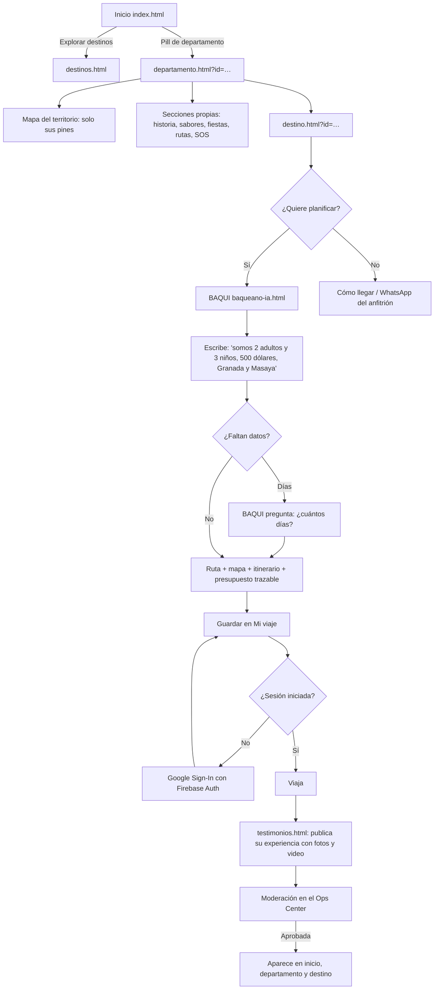
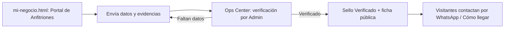
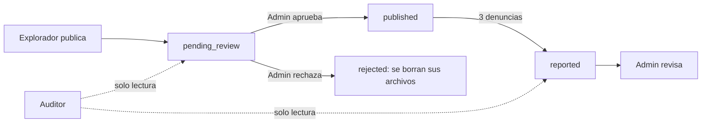

# 🧭 BAQUEANO — Flujo UX, wireframes y accesibilidad

## 🎯 POR QUÉ (Propósito)
Mostrar cómo una persona pasa de "no sé a dónde ir" a "ya tengo mi ruta y publiqué mi experiencia" con el menor esfuerzo posible, y demostrar que el producto es usable por todas las personas (WCAG 2.1 AA).

## ⚙️ CÓMO (Método)
- **Flujos** en Mermaid (se ven directo en GitHub). Corresponden a páginas reales de `website/`.
- **Wireframes** de baja fidelidad (ASCII), móvil primero (360 px). La alta fidelidad es el sitio publicado en `https://baqueanonicaragua.com`.
- **Accesibilidad** verificada con pruebas automáticas del repositorio y revisión manual.

## 📦 QUÉ (Entregables)

### 1. Flujo principal del explorador



### 2. Flujo del emprendedor (anfitrión)



### 3. Flujo de moderación y roles



### 4. Wireframes (móvil, 360 px)

**Inicio**
```text
┌──────────────────────────────┐
│ [≡]  BAQUEANO        [ES ▾]  │  ← barra fija, selector de 6 idiomas
├──────────────────────────────┤
│  ░░░ video del territorio ░░ │
│  DESCUBRÍ LO QUE NO SALE     │
│  EN EL MAPA                  │
│  [ Explorar destinos ]       │  ← acción principal (naranja)
├──────────────────────────────┤
│ (Madriz)(León)(Rivas)(…) →   │  ← píldoras de los 17 territorios
├──────────────────────────────┤
│ DESTINOS QUE  Inspiran       │
│ ┌────┐ ┌────┐ ┌────┐  →      │
├──────────────────────────────┤
│ Experiencias de viajeros     │  ← galería infinita con pausa
│ ◄ [foto][★★★★★][♥ 12] ►      │
│ [ Compartí tu experiencia ]  │
├──────────────────────────────┤
│ SOS 118 · 128 · 115          │
└──────────────────────────────┘
```

**Departamento**
```text
┌──────────────────────────────┐
│ ← RIVAS                      │
│ [foto hero]  Cabecera · Área │
├──────────────────────────────┤
│ 1. Qué es Rivas              │
│ 2. Mapa: solo Rivas  [pines] │
│ 3–6. Municipios, destinos…   │
│ 7. Línea de tiempo           │
│ 8. Lugares emblemáticos      │
│ 9. Sabores (tabla)           │
│ …  Fiestas · Naturaleza ·    │
│    Leyendas · Rutas · Qué    │
│    llevar · SOS · Código     │
│ Experiencias de Rivas        │
└──────────────────────────────┘
```

**BAQUI**
```text
┌──────────────────────────────┐
│ BAQUI 🐦                     │
│ ┌──────────────────────────┐ │
│ │Bot: Contame destinos,    │ │
│ │días, cuántos viajan…     │ │
│ │Vos: somos 2 adultos y 3  │ │
│ │niños, $500, Granada…     │ │
│ │Bot: …me falta saber      │ │
│ │cuántos días.             │ │
│ └──────────────────────────┘ │
│ [ Escribí tu consulta…  ][➤] │
├──────────────────────────────┤
│ [ MAPA con la ruta ]         │
│ Día 1 Granada · Día 2 Masaya │
│ Presupuesto: $500 · pendiente│
└──────────────────────────────┘
```

**Ops Center (Auditor)**
```text
┌──────────────────────────────────────────────┐
│ 👁 Modo Auditor: podés revisar, no modificar │  ← banner fijo
├───────────┬──────────────────────────────────┤
│ Menú      │ Moderación de la comunidad       │
│ · Moder.  │ [Pendientes 3][Publicadas 12]…   │
│ · Auditor.│ ┌ Experiencia … ───────────────┐ │
│ · Respal. │ │ texto · fotos · denuncias     │ │
│           │ │ [Solo lectura (Auditor)]      │ │
│           │ └───────────────────────────────┘ │
└───────────┴──────────────────────────────────┘
```

### 5. Accesibilidad (WCAG 2.1 AA)

| Criterio | Implementación | Evidencia |
|---|---|---|
| 1.1.1 Texto alternativo | Imágenes con `alt`; las decorativas con `alt=""` y `aria-hidden` | Páginas en `website/` |
| 1.4.3 Contraste | Paleta medida (ver `03_MANUAL_DE_MARCA…`, sección 4); fix de títulos sobre fondos oscuros en departamentos | `css/pages/departamento.css` |
| 1.4.10 Reflujo | Sin scroll horizontal a 390 px en los 17 territorios | Prueba E2E del 2026-10-04 (SESSION_LOG) |
| 2.1.1 Teclado | Botones nativos; menú de idioma con roles `menu`/`menuitemradio` | `js/global-language.js` |
| 2.4.1 Saltar bloques | Enlace "Ir al contenido principal" (clave `nav.skipNav` en 6 idiomas) | `locales/*.json` |
| 2.4.7 Foco visible | Anillo naranja de 3 px (`outline`) | `css/baqueano-system.css` |
| 2.3.3 Animaciones | Galería con pausa; se respeta `prefers-reduced-motion` | `js/home-community.js` |
| 3.1.1 / 3.1.2 Idioma | `lang` del documento cambia con el idioma (es-NI, en-US, …) | Prueba `i18n-browser.test.mjs` (19 rutas × 6 idiomas) |
| 4.1.2 Nombre y rol | Los controles sin nombre reciben `aria-label` automático en el Ops Center | `ensureOpsAccessibleControlNames` |
| Táctil | Objetivos de toque de 48×48 px como mínimo | `docs/design/DESIGN.md` |
